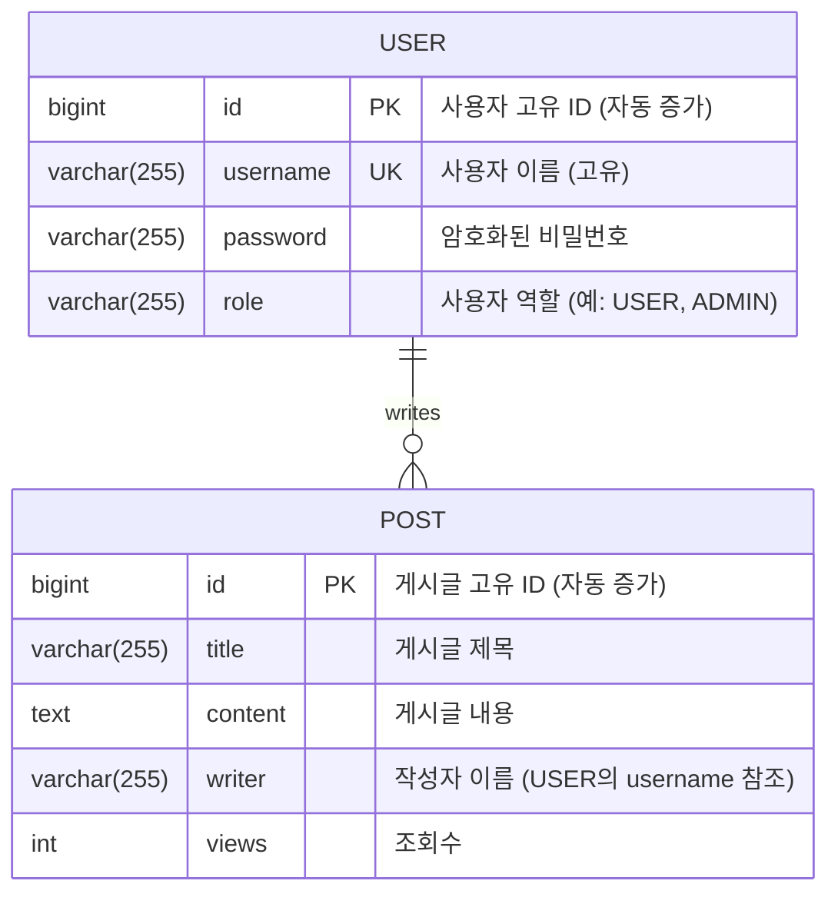

# 📝 데이터베이스 ERD (Entity-Relationship Diagram)

이 문서는 '무한로딩' 프로젝트의 데이터베이스 스키마를 시각적으로 표현한 ERD입니다.

#### 엔티티 설명

-   **USER**: 사용자 정보를 저장하는 테이블입니다. `username`은 고유한 값이어야 합니다.
-   **POST**: 게시글 정보를 저장하는 테이블입니다. `writer` 필드는 `USER` 테이블의 `username`을 참조하여 어떤 사용자가 작성했는지 나타냅니다.

#### 관계

-   한 명의 사용자(**USER**)는 여러 개의 게시글(**POST**)을 작성할 수 있습니다. (1:N 관계)

#### Mermaid 다이어그램

